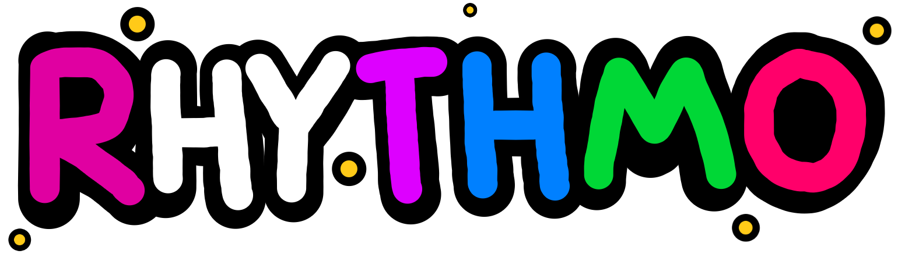

  

  
  
  
  

---

Rhythmo is a simple singleplayer rhythm game made from scratch. Heavily based on [Friday Night Funkin'](https://github.com/FunkinCrew/Funkin/), go check it out!

* You can also download dev builds in the [Actions](https://github.com/JoaTH-Team/Rhythmo-SC/actions) tab.

---

## Features
* Modding System (via [Polymod](https://github.com/larsiusprime/polymod/))
* Softcoded Song & Credits Menu
* Scripting System (HScript & Lua)
* Discord Rich Presence
* RGB Note Coloring
* Language Translations
* Simple Crash Handler
* Achievements
* Noteskins
* Shaders

Additionally, you can check out the planned features in the [To-Do List](/TODO.md).

## Compiling
> **USE THE LINKS ABOVE IF YOU JUST WANT TO PLAY THE GAME!**

If you want to build the game yourself, follow the [compilation guide](https://github.com/JoaTH-Team/Rhythmo-SC/wiki/Building-the-Game).

## Modding
If you want to add your own content, feel free to learn how to mod the game by reading the [documentation](https://github.com/JoaTH-Team/Rhythmo-SC/wiki) and guides to modding.

## Credits
### Main Team (& Contributors)
* Joalor64 - Creator / Main Programmer / Composer / Artist
* Huy1234Th - Additional Programmer / Vietnamese Translation / Lua Code
* Moxie - Additional Programmer
* NeoDev - Additional Translations
* Santiago - Portuguese (Brazil) Translation

### Special Thanks
* [freesound.org](https://freesound.org/) - SFX